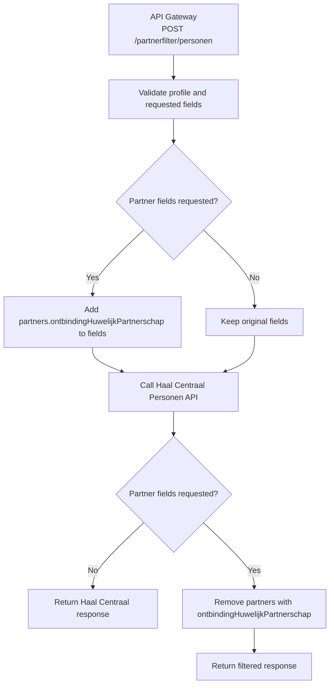

# Partner Filter 

## Lambda tijdelijke oplossing
De partner-filter lambda lost tijdelijk het probleem op tot https://github.com/open-formulieren/open-forms/issues/5856 geimplementeerd is.
De lambda zorgt ervoor dat ontbonden partnerschap niet teruggegeven wordt.




## Gedrag BRP api partners
De BRP levert altijd **maximaal één partner** per persoon in de `partners` array. Er wordt nooit een lijst van alle voormalige partners teruggegeven.

Het leveringsgedrag van Haal Centraal is als volgt:

- Is er een **actieve partner** (huwelijk of geregistreerd partnerschap zonder ontbindingsdatum), dan wordt díe geleverd.
- Is er **geen actieve partner**, dan wordt het **meest recent ontbonden** huwelijk of partnerschap geleverd — inclusief de `ontbindingHuwelijkPartnerschap` datum.

| Situatie                              | Wat de API levert  | `ontbindingHuwelijkPartnerschap` aanwezig? |
| ------------------------------------- | ------------------ | ------------------------------------------ |
| Actief huwelijk of partnerschap       | Huidige partner    | Nee                                        |
| Gescheiden, geen nieuwe partner       | Laatste ex-partner | Ja                                         |
| Weduwe/weduwnaar, geen nieuwe partner | Overleden partner  | Ja                                         |
| Nooit getrouwd/partner gehad          | Lege array         | —                                          |

Voor Open Forms is de regel eenvoudig: **als `ontbindingHuwelijkPartnerschap` aanwezig is in een partnerobject, is de relatie niet meer actief en mag de partner niet getoond worden.**

## RVIG docs HC 2.0 Partner maximaal een
https://brp-api.github.io/Haal-Centraal-BRP-bevragen/v2/features-overzicht bij `Filteren van partner velden`


> Regel: Als er geen actueel huwelijk of geregistreerd partnerschap is, maar wel één of meerdere ontbonden huwelijk of geregistreerd partnerschappen, dan wordt alleen het meest recente ontbonden huwelijk of geregistreerd partnerschap geleverd


## Probleem

Het partners component toont de partner die de BRP teruggeeft zonder te controleren of de relatie nog actief is. Daardoor wordt een ex-partner of overleden partner getoond, terwijl alleen een actieve partner relevant is.
STUF-BG, HC-v1 en HC-v2 vertonen hierin ander gedrag.

Alleen HC-v2 lijkt ook ontbonden relaties als partner terug te geven.
Voorstel is om dus niks in de UI aan te passen, maar wel filtering toe te passen op Haal Centraal BRP API 2.0


## Overzicht testgevallen

Geselecteerd uit https://www.rvig.nl/testsetpersoonslijstenproefomgevingBRPV en getest in acceptatie.

| BSN         | Scenario                                 | BRP levert                              | Verwacht na filter |
| ----------- | ---------------------------------------- | --------------------------------------- | ------------------ |
| `999998778` | Actief huwelijk                          | Partner zonder ontbinding               | 1 partner getoond  |
| `999998626` | Gescheiden                               | Ex-partner met ontbindingsdatum         | 0 partners getoond |
| `999999333` | Ontbonden partnerschap                   | Ex-partner met ontbindingsdatum         | 0 partners getoond |
| `999993239` | Weduwe                                   | Overleden partner met ontbindingsdatum  | 0 partners getoond |
| `999998729` | 2 ex-partners + 1 actief huwelijk        | Actieve partner zonder ontbinding       | 1 partner getoond  |
| `999995972` | Ontbonden huwelijk + actief partnerschap | Actieve partner zonder ontbinding       | 1 partner getoond  |
| `999996241` | 3 ontbonden huwelijken                   | Laatste ex-partner met ontbindingsdatum | 0 partners getoond |

De gevallen `999998729` en `999995972` zijn de kritieke edge cases: er zijn meerdere (ontbonden) relaties in de historie maar de BRP levert de actieve partner — de filter mag die niet weggooien.

BSN `999993239` is ook de basis voor de geautomatiseerde test in `test_brp_clients.py`.

## Aanroepen en resultaten

De aanroepen zijn gedaan met de volgende `fields` in de request body. Dit zijn alle partner-velden die de Haal Centraal API ondersteunt:

```json
[
  "partners.burgerservicenummer",
  "partners.naam.voornamen",
  "partners.naam.voorletters",
  "partners.naam.voorvoegsel",
  "partners.naam.geslachtsnaam",
  "partners.geboorte.datum",
  "partners.ontbindingHuwelijkPartnerschap"
]
```

---

### BSN 999998778 — actief huwelijk

**Verwacht:** partner getoond (`ontbindingHuwelijkPartnerschap` afwezig)

```json
{
  "type": "RaadpleegMetBurgerservicenummer",
  "personen": [
    {
      "partners": [
        {
          "naam": {
            "voornamen": "Adam",
            "geslachtsnaam": "Arendsen",
            "voorletters": "A."
          },
          "geboorte": {
            "datum": {
              "type": "Datum",
              "datum": "1981-01-01",
              "langFormaat": "1 januari 1981"
            }
          },
          "burgerservicenummer": "999998791"
        }
      ]
    }
  ]
}
```

---

### BSN 999998626 — gescheiden

**Verwacht:** niet getoond (`ontbindingHuwelijkPartnerschap` aanwezig)

```json
{
  "type": "RaadpleegMetBurgerservicenummer",
  "personen": [
    {
      "partners": [
        {
          "naam": {
            "voornamen": "Govert",
            "voorvoegsel": "van",
            "geslachtsnaam": "Groningen",
            "voorletters": "G."
          },
          "geboorte": {
            "datum": {
              "type": "Datum",
              "datum": "1982-08-01",
              "langFormaat": "1 augustus 1982"
            }
          },
          "ontbindingHuwelijkPartnerschap": {
            "datum": {
              "type": "Datum",
              "datum": "2020-08-01",
              "langFormaat": "1 augustus 2020"
            }
          },
          "burgerservicenummer": "999998638"
        }
      ]
    }
  ]
}
```

---

### BSN 999999333 — ontbonden partnerschap

**Verwacht:** niet getoond (`ontbindingHuwelijkPartnerschap` aanwezig)

```json
{
  "type": "RaadpleegMetBurgerservicenummer",
  "personen": [
    {
      "partners": [
        {
          "naam": {
            "voornamen": "Sherida",
            "geslachtsnaam": "Malhoe",
            "voorletters": "S."
          },
          "geboorte": {
            "datum": {
              "type": "Datum",
              "datum": "1950-01-01",
              "langFormaat": "1 januari 1950"
            }
          },
          "ontbindingHuwelijkPartnerschap": {
            "datum": {
              "type": "Datum",
              "datum": "2000-03-08",
              "langFormaat": "8 maart 2000"
            }
          },
          "burgerservicenummer": "999993240"
        }
      ]
    }
  ]
}
```

---

### BSN 999993239 — weduwe

**Verwacht:** niet getoond (`ontbindingHuwelijkPartnerschap` aanwezig door overlijden partner)

```json
{
  "type": "RaadpleegMetBurgerservicenummer",
  "personen": [
    {
      "partners": [
        {
          "naam": {
            "voornamen": "Mattheus",
            "voorvoegsel": "du",
            "geslachtsnaam": "Burck",
            "voorletters": "M."
          },
          "geboorte": {
            "datum": {
              "type": "Datum",
              "datum": "1922-09-25",
              "langFormaat": "25 september 1922"
            }
          },
          "ontbindingHuwelijkPartnerschap": {
            "datum": {
              "type": "Datum",
              "datum": "2022-03-01",
              "langFormaat": "1 maart 2022"
            }
          },
          "burgerservicenummer": "999990639"
        }
      ]
    }
  ]
}
```

---

### BSN 999998729 — 2 ex-partners + 1 actief huwelijk

**Verwacht:** partner getoond (`ontbindingHuwelijkPartnerschap` afwezig — BRP levert de actieve partner)

```json
{
  "type": "RaadpleegMetBurgerservicenummer",
  "personen": [
    {
      "partners": [
        {
          "naam": {
            "voornamen": "Hessel",
            "voorvoegsel": "van",
            "geslachtsnaam": "Henegouwen",
            "voorletters": "H."
          },
          "geboorte": {
            "datum": {
              "type": "Datum",
              "datum": "1972-06-02",
              "langFormaat": "2 juni 1972"
            }
          },
          "burgerservicenummer": "999998742"
        }
      ]
    }
  ]
}
```

---

### BSN 999995972 — ontbonden huwelijk + actief geregistreerd partnerschap

**Verwacht:** partner getoond (`ontbindingHuwelijkPartnerschap` afwezig — BRP levert de actieve partner)

```json
{
  "type": "RaadpleegMetBurgerservicenummer",
  "personen": [
    {
      "partners": [
        {
          "naam": {
            "voornamen": "Denise Desiree Dorothea",
            "geslachtsnaam": "Speelman",
            "voorletters": "D.D.D."
          },
          "geboorte": {
            "datum": {
              "type": "Datum",
              "datum": "1989-05-25",
              "langFormaat": "25 mei 1989"
            }
          },
          "burgerservicenummer": "999996034"
        }
      ]
    }
  ]
}
```

---

### BSN 999996241 — 3 ontbonden huwelijken

**Verwacht:** niet getoond (`ontbindingHuwelijkPartnerschap` aanwezig — BRP levert de meest recent ontbonden partner)

```json
{
  "type": "RaadpleegMetBurgerservicenummer",
  "personen": [
    {
      "partners": [
        {
          "naam": {
            "voornamen": "Christina Annabel",
            "geslachtsnaam": "Christiaansen",
            "voorletters": "C.A."
          },
          "geboorte": {
            "datum": {
              "type": "Datum",
              "datum": "1970-07-17",
              "langFormaat": "17 juli 1970"
            }
          },
          "ontbindingHuwelijkPartnerschap": {
            "datum": {
              "type": "Datum",
              "datum": "2015-05-12",
              "langFormaat": "12 mei 2015"
            }
          },
          "burgerservicenummer": "999996277"
        }
      ]
    }
  ]
}
```
